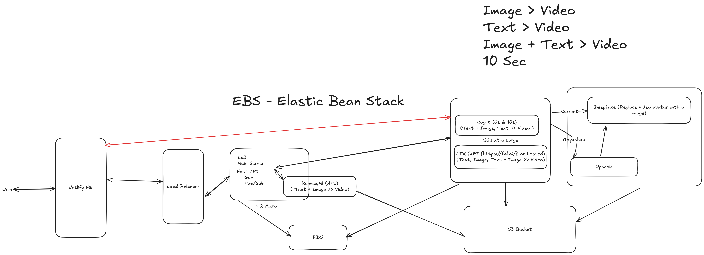

# Text-to-Video Generation System

This project provides a system for generating videos from text prompts, images, or a combination of both. It includes a FastAPI backend for handling video generation requests and a Streamlit frontend for user interaction.

## Pipeline


## Project Structure

```
backend/
|── .env
|── main.py
|── models.py
|── requirnments.py
|── s3_utils.py
└── tasks.py

frontend/
|── app.py
```

## Backend

The backend is implemented using FastAPI and provides endpoints for generating videos from text, images, or both. It also includes utilities for uploading files to S3.

### Endpoints

- **POST /generate-text-video**: Generates a video from a text prompt.
- **POST /generate-image-video**: Generates a video from an uploaded image.
- **POST /generate-text-image-video**: Generates a video from a text prompt and an uploaded image.
- **POST /status/{task_id}**: Retrieves the status of a task.

### Files

- main.py: Main FastAPI application with endpoints for video generation.
- models.py: Pydantic models for request validation.
- s3_utils.py: Utilities for uploading files to S3.
- tasks.py: Task processing functions for video generation.

## Frontend

The frontend is implemented using Streamlit and provides a user interface for interacting with the backend.

### Features

- Select input type: Text, Image, or Text + Image.
- Enter text prompt and/or upload an image.
- Generate video and display the result.
- Check the status of a task.

### Files

- app.py: Streamlit application for user interaction.

## Installation

1. Clone the repository:
    ```sh
    git clone https://github.com/Dineth9D/text-to-video.git
    cd text-to-video
    ```

2. Set up the backend:
    ```sh
    cd backend
    python -m venv .venv
    venv\Scripts\activate
    pip install -r requirements.txt
    ```

3. Set up the frontend:
    ```sh
    cd ../frontend
    python -m venv .venv
    .venv\Scripts\activate
    pip install -r requirements.txt
    ```

## Usage

1. Start the backend server:
    ```sh
    cd backend
    uvicorn main:app --reload
    ```

2. Start the frontend application:
    ```sh
    cd ../frontend
    streamlit run app.py
    ```

3. Open your browser and go to `http://localhost:8501` to use the application.